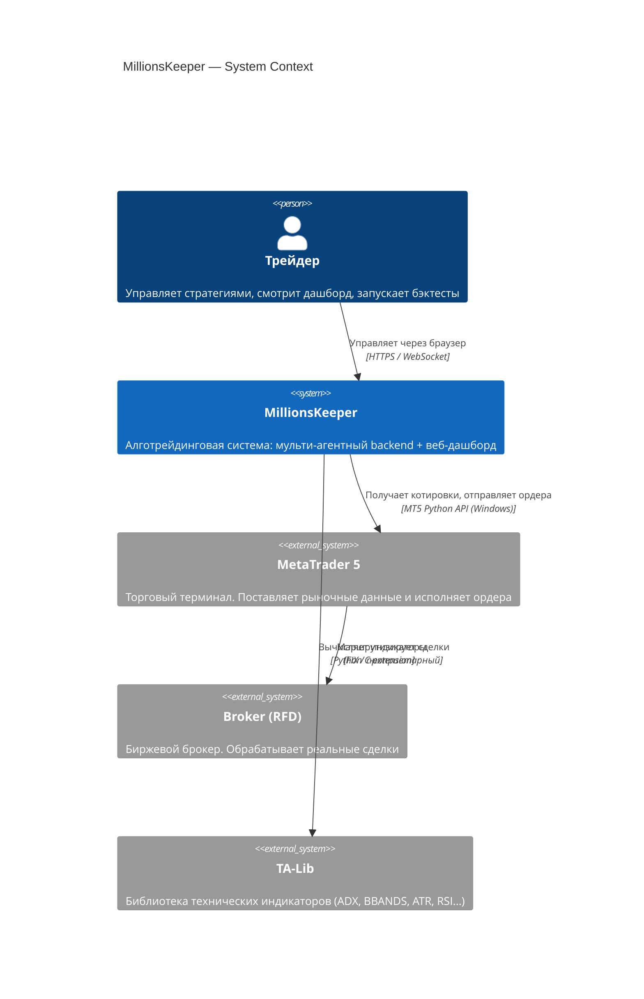
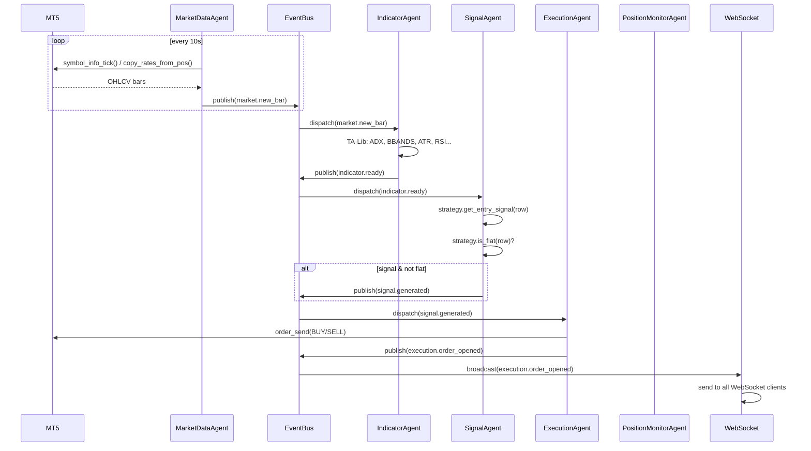
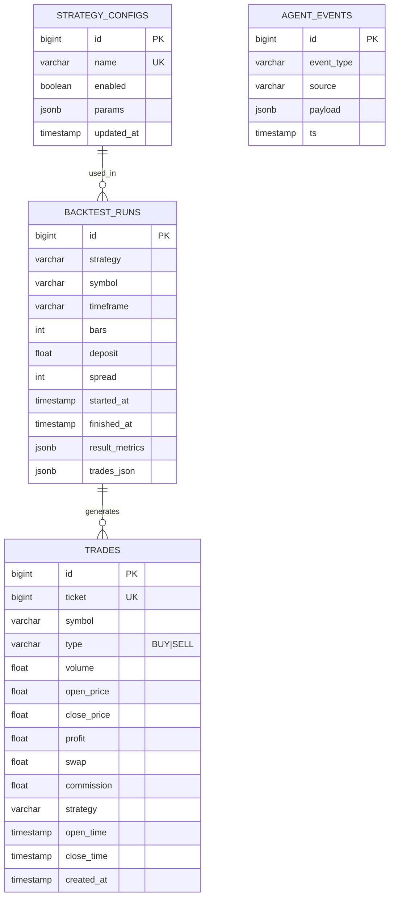

# C4 Architecture — MillionsKeeper v2

> Диаграммы в формате Mermaid. Уровни: Context → Container → Component.

---

## Level 1: System Context



---

## Level 2: Container Diagram

```mermaid
C4Container
  title MillionsKeeper — Container Diagram

  Person(trader, "Трейдер")

  Container_Boundary(mk, "MillionsKeeper System") {

    Container(frontend, "Web Dashboard", "React 18 + TypeScript + Vite + MUI v7",
      "SPA: мониторинг позиций, управление стратегиями, бэктест UI, история P&L")

    Container(backend, "Trading Backend", "Python 3.11 + FastAPI + asyncio",
      "Мульти-агентный движок: рыночные данные, индикаторы, сигналы, исполнение ордеров")

    ContainerDb(postgres, "PostgreSQL 16", "Database",
      "Персистентность: история сделок, результаты бэктестов, конфигурации стратегий")

    ContainerDb(redis, "Redis 7", "Cache / Message Broker",
      "Кэш рыночных данных, сессии WebSocket, pub/sub для горизонтального масштабирования")
  }

  System_Ext(mt5, "MetaTrader 5")

  Rel(trader, frontend, "Открывает в браузере", "HTTPS")
  Rel(frontend, backend, "REST API + WebSocket", "HTTP/WS :8080")
  Rel(backend, mt5, "Котировки / ордера", "MT5 Python API")
  Rel(backend, postgres, "Читает/пишет", "asyncpg / SQLAlchemy")
  Rel(backend, redis, "Кэш + pub/sub", "aioredis")
```

---

## Level 3: Component — Backend

```mermaid
C4Component
  title Backend — Component Diagram

  Container_Boundary(backend, "Trading Backend (Python / FastAPI)") {

    Component(config, "Config", "Pydantic Settings v2",
      "Валидация .env: MT5 credentials, DB URLs, таймфреймы, лимиты риска")

    Component(eventbus, "EventBus", "asyncio.Queue + wildcard subscriptions",
      "Шина событий. Роутинг: market.*, indicator.*, signal.*, execution.*, position.*, account.*")

    Component(registry, "AgentRegistry", "Dict[str, AgentInfo]",
      "Реестр агентов: статус, метрики, последний запуск. Источник для /api/agents")

    Component(mda, "MarketDataAgent", "BaseAgent",
      "Опрашивает MT5 каждые 10с. Публикует market.new_bar, инвалидирует кэш")

    Component(ia, "IndicatorAgent", "BaseAgent",
      "Подписан на market.new_bar. Вычисляет TA-Lib индикаторы. Публикует indicator.ready")

    Component(sa, "SignalAgent", "BaseAgent",
      "Подписан на indicator.ready. Запускает стратегии. Публикует signal.generated")

    Component(ea, "ExecutionAgent", "BaseAgent",
      "Подписан на signal.generated. Открывает/закрывает позиции через Trading Service")

    Component(pma, "PositionMonitorAgent", "BaseAgent",
      "Опрашивает позиции каждые 5с. Публикует position.update, rsi_exit_triggered")

    Component(ha, "HistoryAgent", "BaseAgent",
      "Опрашивает историю каждые 5мин. Сохраняет сделки в PostgreSQL")

    Component(ba, "BacktestAgent", "BaseAgent",
      "Подписан на backtest.started. Запускает BacktestEngine. Публикует backtest.result")

    Component(aa, "AccountAgent", "BaseAgent",
      "Опрашивает баланс каждые 30с. Публикует account.update")

    Component(trading, "Trading Service", "MT5Broker + risk calculator",
      "Абстракция над MT5: orderOpen, orderClose, calculateSL/TP, позиции. Инъецируется в агентов")

    Component(strategies, "Strategy Registry", "Dict[str, BaseStrategy]",
      "9 скальпинг-стратегий. Все наследуют BaseStrategy с flat-detector")

    Component(backtest_engine, "BacktestEngine", "pandas + TA-Lib",
      "Движок бэктеста: walk-forward, метрики (Sharpe, MaxDD, WinRate, PF)")

    Component(api, "API Routes", "FastAPI Router",
      "REST: /api/agents, /api/account, /api/positions, /api/history, /api/backtest, /api/trading")

    Component(ws, "WebSocket Manager", "FastAPI WebSocket",
      "Бридж EventBus → WS клиенты. Снепшот истории при подключении")

    Component(cache, "Market Data Cache", "Redis + in-memory fallback",
      "Symbol info, тики, OHLCV бары. TTL по таймфреймам")
  }

  Rel(mda, eventbus, "publish market.*")
  Rel(ia, eventbus, "subscribe market.*, publish indicator.*")
  Rel(sa, eventbus, "subscribe indicator.*, publish signal.*")
  Rel(ea, eventbus, "subscribe signal.*, publish execution.*")
  Rel(pma, eventbus, "publish position.*")
  Rel(ha, eventbus, "subscribe *, publish history.*")
  Rel(ba, eventbus, "subscribe backtest.started, publish backtest.result")
  Rel(aa, eventbus, "publish account.*")
  Rel(ws, eventbus, "subscribe *")
  Rel(ea, trading, "uses")
  Rel(pma, trading, "uses")
  Rel(sa, strategies, "uses")
  Rel(ba, backtest_engine, "uses")
  Rel(backtest_engine, strategies, "uses")
  Rel(mda, cache, "writes")
  Rel(ia, cache, "reads")
```

---

## Level 3: Component — Frontend

```mermaid
C4Component
  title Frontend — Component Diagram

  Container_Boundary(frontend, "Web Dashboard (React 18 / TypeScript / Vite)") {

    Component(app, "App", "React Router v6",
      "Роутинг: /, /backtest, /strategies, /history, /settings")

    Component(dash, "Dashboard Page", "React + MUI",
      "Виджеты: AccountCard, PositionsTable, AgentStatusGrid, EventFeed")

    Component(bt_page, "Backtest Page", "React + MUI",
      "Форма запуска, прогресс, результаты (Sharpe, DD, WinRate), equity curve chart")

    Component(strat_page, "Strategies Page", "React + MUI",
      "Список стратегий, включение/выключение, параметры, live статус")

    Component(hist_page, "History Page", "React + MUI + Recharts",
      "P&L по дням/неделям/месяцам, таблица сделок, фильтры")

    Component(ws_hook, "useWebSocket", "Custom Hook",
      "Управляет WS соединением. Реконнект с backoff. Диспатч событий в store")

    Component(store, "Trading Store", "Zustand",
      "Глобальный state: agents, positions, account, backtest results, events")

    Component(api_client, "API Client", "axios + React Query",
      "REST вызовы с кэшированием. Типизированные через OpenAPI-generated types")

    Component(types, "Types", "TypeScript interfaces",
      "Event, Agent, Position, BacktestResult, Strategy — синхронизированы с backend Pydantic")
  }

  Rel(app, dash, "route /")
  Rel(app, bt_page, "route /backtest")
  Rel(app, strat_page, "route /strategies")
  Rel(app, hist_page, "route /history")
  Rel(dash, store, "reads")
  Rel(bt_page, api_client, "POST /api/backtest")
  Rel(strat_page, api_client, "GET/POST /api/trading/status")
  Rel(ws_hook, store, "dispatches updates")
  Rel(api_client, store, "writes")
```

---

## EventBus Flow (Sequence)



---

## Database Schema (PostgreSQL)


