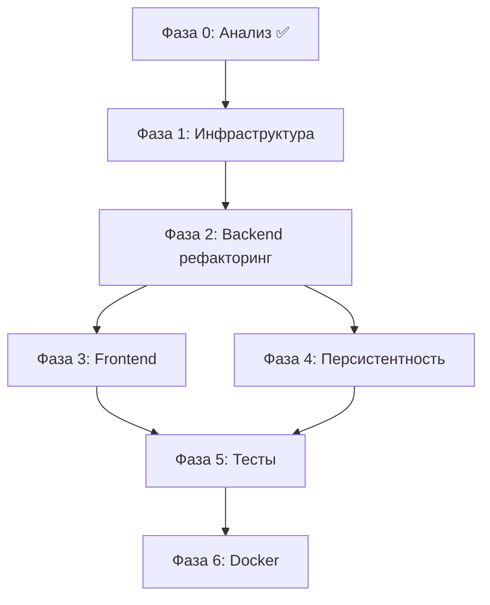

# MillionsKeeper v2 — Roadmap реализации

> Gepetto-style план: фазы, задачи, зависимости, приоритеты.

---

## Фаза 0: Анализ и планирование ✅

| Задача | Статус |
|--------|--------|
| Анализ v1 codebase | ✅ |
| Создание .claude/project-context.md | ✅ |
| C4 архитектурные диаграммы | ✅ |
| Определение целевого стека | ✅ |
| Roadmap (этот документ) | ✅ |

---

## Фаза 1: Инфраструктура и конфигурация ✅

**Цель:** Убрать глобальные mutable state, добавить Pydantic Settings, подготовить Docker.

### 1.1 Config Management
- [x] `backend/app/core/config.py` — Pydantic Settings v2 (M1+H1, JWT, PostgreSQL, Redis)
- [x] `.env.example` с документацией всех переменных
- [x] `.env` — обновлён (убран Telegram, добавлены v2 переменные)

### 1.2 Docker Compose
- [x] `docker/docker-compose.yml` — PostgreSQL + Redis (prod)
- [x] `docker/docker-compose.dev.yml` — PostgreSQL + Redis + pgAdmin (dev)
- [x] `backend/Dockerfile` — multi-stage (builder + runtime, TA-Lib included)
- [x] `.dockerignore`

### 1.3 Database Setup
- [x] `backend/alembic/` — инициализация (env.py, script.py.mako, alembic.ini)
- [x] `backend/app/models/db.py` — SQLAlchemy 2.0 ORM модели
- [x] Миграция 001: таблица `trades`
- [x] Миграция 002: таблица `backtest_runs`
- [x] Миграция 003: таблица `strategy_configs` (seed 10 стратегий)
- [x] Миграция 004: таблица `agent_events`
- [x] `backend/requirements.txt` — полный список зависимостей v2

**Зависимости:** Нет (стартовая фаза)
**Блокирует:** Фазы 2, 3, 4

---

## Фаза 2: Backend рефакторинг ✅

**Цель:** Чистая архитектура, DI, разделение ответственности.

### 2.1 Core
- [x] `backend/app/core/database.py` — async SQLAlchemy engine + session factory
- [x] `backend/app/core/config.py` — Pydantic Settings v2

### 2.2 Trading Service
- [x] `backend/app/trading/broker.py` — MT5Broker (IBroker)
- [x] `backend/app/trading/risk.py` — RiskCalculator (объём, SL/TP, trailing)
- [x] `backend/app/trading/service.py` — TradingService (DI оркестратор)

### 2.3 Агенты (8 штук с DI, без прямых mt5.*/settings)
- [x] base, market_data (M1+H1), indicator, signal, execution
- [x] position_monitor, history (→ PostgreSQL), backtest (→ PostgreSQL), account

### 2.4 BacktestEngine
- [x] `backend/app/backtest/engine.py` — движок для любой BaseStrategy
- [x] `backend/app/backtest/metrics.py` — BacktestResult (Sharpe, MaxDD, WinRate, PF)

### 2.5 Strategies
- [x] `backend/app/strategies/registry.py` — StrategyRegistry (lazy-load)
- [x] `backend/app/strategies/alligator.py` — из alligatorBot.py

### 2.x Entry point
- [x] `backend/app/main.py` — DI-based точка входа

**Зависимости:** Фаза 1 ✅

---

## Фаза 3: Frontend React/TypeScript ✅

**Цель:** Заменить plain HTML/JS на полноценный React SPA.

### 3.1 Инициализация
- [x] `frontend/package.json` — Vite + React 18 + TypeScript
- [x] MUI v7: `@mui/material @mui/icons-material @emotion/react @emotion/styled`
- [x] Zustand: `zustand`
- [x] React Query: `@tanstack/react-query`
- [x] Recharts: `recharts`
- [x] axios: `axios`

### 3.2 Инфраструктура frontend
- [x] `src/types/index.ts` — TypeScript интерфейсы (Agent, Position, Trade, BacktestResult...)
- [x] `src/api/client.ts` — axios instance с base URL + JWT interceptors
- [x] `src/api/endpoints.ts` — типизированные API вызовы
- [x] `src/hooks/useWebSocket.ts` — WebSocket с авто-реконнектом (exponential backoff)
- [x] `src/store/tradingStore.ts` — Zustand store (account, positions, agents, events)
- [x] `src/theme.ts` — MUI v7 тёмная тема (торговый стиль, JetBrains Mono для цифр)
- [x] `vite.config.ts` — proxy /api + /ws → backend:8080
- [x] `tsconfig.json` — strict TS
- [x] `index.html` — mobile viewport, Inter/JetBrains Mono шрифты

### 3.3 Страницы
- [x] `Dashboard` — AccountCard + PositionsTable + AgentStatusGrid + EventFeed
- [x] `BacktestPage` — форма запуска + EquityCurveChart + MetricsCard + история запусков
- [x] `StrategiesPage` — список с enable/disable + редактор параметров
- [x] `HistoryPage` — P&L bar chart + TradesTable с фильтрами

### 3.4 Компоненты
- [x] `AccountCard` — баланс, equity, margin, margin level
- [x] `PositionsTable` — позиции + кнопка закрыть (useMutation)
- [x] `AgentStatusGrid` — карточки агентов (IDLE/RUNNING/ERROR + LinearProgress)
- [x] `EventFeed` — realtime лента событий (цветовое кодирование по типу)
- [x] `EquityCurveChart` — Recharts AreaChart + maxDD + net P&L
- [x] `MetricsCard` — Sharpe, MaxDD, WinRate, PF, Return%, consecutive losses

### 3.5 Layout
- [x] `App.tsx` — адаптивный layout: Sidebar (desktop) + BottomNavigation (mobile)
- [x] `main.tsx` — QueryClientProvider + ThemeProvider + CssBaseline

**Зависимости:** Фаза 2 (API endpoints должны быть готовы)

---

## Фаза 4: Персистентность ✅

**Цель:** Redis кэш + PostgreSQL история + backtest storage.

### 4.1 Redis кэш
- [x] `backend/app/cache/market_cache.py` — Redis-based (TTL: M1=70s, H1=3610s, D1=86410s)
  - Key pattern: `mk:bars:{symbol}:{timeframe}`, `mk:account`, `mk:positions`
- [x] Fallback на in-memory при недоступности Redis (автоматически)

### 4.2 PostgreSQL persistence
- [x] `HistoryAgent` пишет закрытые сделки в `trades`
- [x] `BacktestAgent` пишет результаты в `backtest_runs`
- [x] `/api/history` читает из PostgreSQL (фильтры: symbol, from_date, to_date, limit)
- [x] `/api/backtest/results` — список прошлых бэктестов с пагинацией

### 4.3 Strategy Config persistence
- [x] Конфиги стратегий из `strategy_configs` таблицы
- [x] `GET /api/strategies` — список из БД
- [x] `PUT /api/strategies/{name}` — update enabled + params
- [x] Frontend: редактор параметров (StrategiesPage)

### 4.4 FastAPI v2 app + Auth
- [x] `backend/web/app.py` — новое приложение (заменяет web/app.py v1)
  - CORS middleware (cors_origins из config)
  - `/ws/events` WebSocket с realtime bridge на EventBus
  - Prod: SPA fallback (frontend/dist)
  - Dev: `/api/docs` (Swagger)
- [x] `backend/app/api/auth.py` — JWT на основе MT5 login/password/server
- [x] `backend/app/api/websocket.py` — WSManager + ws_event_bridge
- [x] `backend/app/api/routes.py` — все REST эндпоинты (account, positions, agents, events, backtest, strategies, history)
- [x] `backend/app/models/schemas.py` — обновлены: AccountInfoSchema, BacktestMetrics, StrategyInfo

**Зависимости:** Фазы 1, 2

---

## Фаза 5: Тестирование ✅

**Цель:** Coverage > 70% для критических компонентов.

### 5.1 Backend tests (pytest)
- [x] `backend/pytest.ini` — asyncio_mode=auto, markers unit/integration/slow
- [x] `tests/conftest.py` — mock MT5 (sys.modules), SQLite in-memory, fake_cache, mock_broker
- [x] `tests/unit/test_backtest_engine.py` — weekend block, SL/TP hit, P&L, volume calc (25 тестов)
- [x] `tests/unit/test_metrics.py` — BacktestResult: win_rate, PF, sharpe, drawdown, metrics_dict (20 тестов)
- [x] `tests/unit/test_risk_calculator.py` — sl_tp_from_atr, clamp_volume, position_volume (15 тестов)
- [x] `tests/unit/test_strategies.py` — AlligatorStrategy + StrategyRegistry + Engine integration (12 тестов)
- [x] `tests/integration/test_api_routes.py` — FastAPI TestClient + SQLite: auth, account, positions, backtest, strategies, history (20 тестов)

### 5.2 Frontend tests (Vitest + RTL)
- [ ] `src/components/__tests__/AccountCard.test.tsx`
- [ ] `src/components/__tests__/PositionsTable.test.tsx`
- [ ] `src/hooks/__tests__/useWebSocket.test.ts`

**Запуск:**
```bash
cd backend
pip install pytest pytest-asyncio httpx aiosqlite
pytest -m unit          # только unit (быстрые, без deps)
pytest -m integration   # интеграционные
pytest                  # все тесты
```

**Зависимости:** Фазы 2, 3

---

## Фаза 6: Docker деплой ✅

**Цель:** Запуск одной командой `docker compose up`.

- [x] `backend/Dockerfile` — multi-stage (builder + runtime), healthcheck на `/api/docs`
- [x] `frontend/Dockerfile` — Node 20 builder → nginx:1.27-alpine static server
- [x] `nginx/nginx.conf` — SPA fallback, /api → backend, /ws → backend (upgrade), asset cache
- [x] `nginx/nginx.prod.conf` — prod конфиг: backend через `host.docker.internal:8080`
- [x] `docker/docker-compose.prod.yml` — PostgreSQL + Redis + Frontend (nginx)
  - Health checks для всех сервисов
  - Volume mounts для данных (postgres_data, redis_data)
  - Порты только на 127.0.0.1 для БД (безопасность)
- [x] `.env.example` — добавлены BACKEND_HOST/BACKEND_PORT для prod

**Архитектура деплоя (Windows):**
```
[Browser] → Docker nginx:80
               ├── /        → React SPA (nginx static)
               ├── /api/*   → host.docker.internal:8080 (нативный FastAPI)
               └── /ws/*    → host.docker.internal:8080 (нативный WS)

Docker:
  ├── postgres:5432  (только 127.0.0.1)
  ├── redis:6379     (только 127.0.0.1)
  └── nginx:80       (0.0.0.0 — публичный)

Windows (нативно):
  └── python -m app.main  (MT5 + FastAPI + Agents)
```

**Запуск:**
```bash
# 1. Инфраструктура
docker compose -f docker/docker-compose.prod.yml up -d

# 2. Миграции БД
cd backend && alembic upgrade head

# 3. Backend (нативно на Windows, MT5 должен быть запущен)
python -m app.main

# 4. Фронтенд доступен на http://localhost
```

**Зависимости:** Все предыдущие фазы

---

## Приоритеты и зависимости



---

## Стек технологий v2

| Слой | Технология | Версия |
|------|-----------|--------|
| Backend lang | Python | 3.11+ |
| Web framework | FastAPI | 0.111+ |
| Async | asyncio | stdlib |
| Config | Pydantic Settings | v2 |
| DB ORM | SQLAlchemy | 2.0 async |
| Migrations | Alembic | latest |
| DB | PostgreSQL | 16 |
| Cache | Redis | 7 |
| MT5 | MetaTrader5 | latest |
| Indicators | TA-Lib | 0.4.x |
| Frontend | React | 18 |
| Language | TypeScript | 5+ |
| Build tool | Vite | 5+ |
| UI library | MUI | v7 |
| State | Zustand | 4+ |
| Data fetching | React Query | v5 |
| Charts | Recharts | 2+ |
| Testing BE | pytest + pytest-asyncio | latest |
| Testing FE | Vitest + RTL | latest |
| Container | Docker + Compose | latest |
| Web server | Nginx | alpine |

---

## Архитектурные решения (зафиксированы 2026-04-09)

- **`alligatorBot.py`** → декомпозировать в `strategies/alligator.py`
- **Аутентификация** → MT5 login/password/server (JWT сессия на основе успешного MT5 логина)
- **Telegram** → не реализовывать; фокус на мобильном responsive веб-интерфейсе
- **БД** → PostgreSQL через Docker Compose (не SQLite)
- **Таймфреймы** → M1 + H1 (M1 как основной для скальпинга, H1 для фильтра тренда)

---

*Документ создан: 2026-04-09*
*Следующий шаг: Фаза 1 — настройка Pydantic Settings и Docker Compose*
